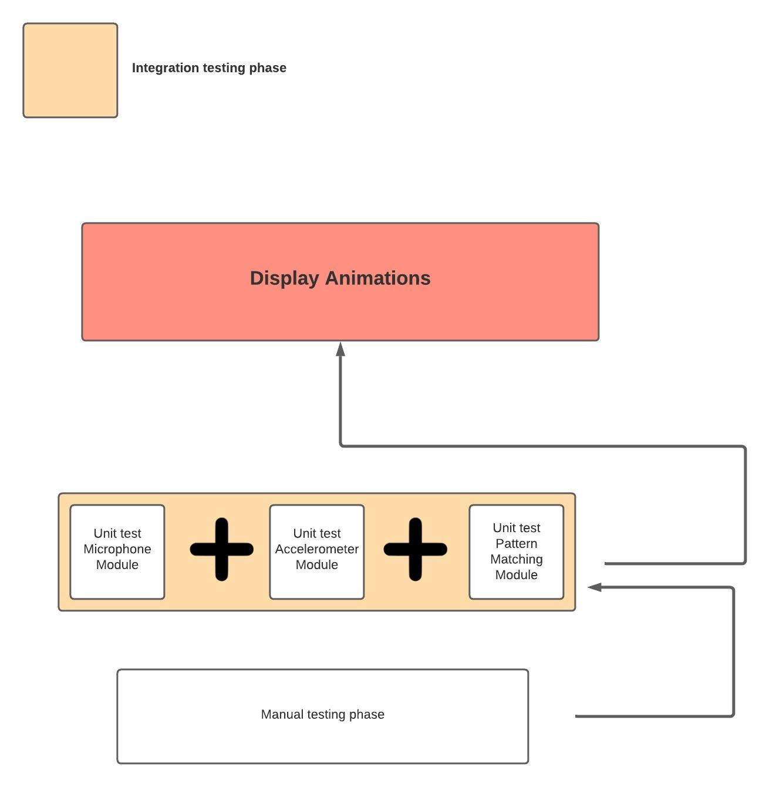

## Overview of testing
Testing is a major part of this project, as it was crucial to be isolating the key components such as the accelerometer, microphone, led lights, buttons and speaker. 


## 
**Manual testing :-**
When executing an Arduino program there is one loop function "void loop()". The loop is infinite and therefore output is consistently being displayed, 
we used the built in serial monitor which would display certain "messages" dependent on the component we were using.

Manual testing was mainly used for the accelerometer, microphone and buttons , as these compenents values would only change if me or my partner would alter with it. 

We had expected outputs , which would be displayed in the serial monitor when our testing conditions were met. We created various conditions which can be seen in the process of testing below , there is also videos and images of the manual testing being conducted in the testing directory.
## 
**Unit testing :-**
Arduino has a unit testing framework which is  "#include <ArduinoUnit.h>". Similar to Python , we were capable of using "assertEqual" and "assertNotEqual". This allowed us to isolate functions , meaning we could insert various values and test if it passed or failed.

Unit testing was far better for time consumpation in comparsion with manual testing , as we could test multiples inputs at once.
## 
**Integration testing:-** 
Integration testing could only be initialized when Unit testing was complete. As Integration testing is a step by step process , for example we could not Unit test function1 until we were satisfied with Unit test for function0.

This was the phase of the testing when we had to combine all methods to operate in the void loop() function sequentially. Even though the Unit testing was complete ,integeration testing is a necessity before being validated as its the key functionallity of the project.    

## 
**Systematic testing:-**  
Once the Integration testing was complete , Systematic testing was basically using the final product with differnt inputs. This would give better clarification if our project had met our desired goals.
## 
# Process of testing
## Test 0 - Manually test circuit playground basic leds
Read up on how the components are going to be wired using the MAX7219’s datasheet and Adafruit Circuit Playground Classic’s datasheet. Played around with, verifying the built in components in the microcontroller is functioning by using built in examples such as blink.


## Test 1 - Manually test led matrix
 A guide in makeguides.com enables us to display text on the MAX7219 LED dot matrix display using the required Arduino libraries such as MD_Parola.h, MD_MAX72xx.h and SPI for communicating with the microcontroller and external devices. This allowed display text such as “Hello World” into our LED Matrix. We tried to incorporate the accelerometer using the library Adafruit_CircuitPlayground.h but ran into memory problems, as soon as you initialized the library the sketch exceeded the available space on the board. It used up 105% of the 30130 bytes available and the code would not compile.

## Test 2 - Manually test microphone 
 Our project is based mainly on user sound input, we wanted to test the microphone that is built-in on an Adafruit circuit playground. The program we used would turn on more LED light on the circuit depending on how loud the volume was. We tested the sound input by speaking into it with different sound levels. The “serial monitor” would be used while the program is executing to view sound levels in baud, we used this code below to print sound levels in the serial monitor.

## Test 3 - Manually test animations
Along with the memory error we were also unable to customize the animations with the library we have been using so far. We had to look into different libraries that allowed us to control each individual LED in the matrix in order to create the desired shapes we wanted for each of the animations. A library called “LedControl.h” allowed us to do this. It provided documentation to light up a single individual LED. This also solved the problem with the memory error where the last one took up 107% of the 30000 bytes while this took up only 47% of the memory. The library worked for the 8 x 8 matrix and also the 8 x 32 matrix. The first two animations were a stationary mouth closed and a mouth that is open.

## Test 4 - Manual test sound level
 In test 2 where we used the function analogRead where it reads a specific analog pin on the Arduino board such as the microphone which converted the voltage into integer values between 0 and 1023. Those values appeared on the serial monitor but it got too disconcerting as the values would decrease near the 100’s when you speak loudly and 350 when its quiet and on occasion would have a value less than a 100 when speaking in a normal tone despite the expected readings. Instead of using baud as the unit of measurement of the microphone decibels was used instead. Using CircuitPlayground.mic.soundPressureLevel(); the values were to scale. A conversation would have a decibel value of around 60 and a stationary value is around 50. 

 From manually testing the CircuitPlayground.mic.soundPressureLevel() function , we came to the conclusion that 10ms inside the parameters would be the most efficient time.
 Once satisfied with CircuitPlayground.mic.soundPressureLevel(10); , we then began unit testing the function.
## Test 5 - Unit test for speaking volume (CircuitPlayground.mic.soundPressureLevel(10);)

```
#line 2 "sketch_1.ino"
#include <ArduinoUnit.h>
#include <Adafruit_CircuitPlayground.h>

test(roomVolume) 
{
  int noise = 57;
  int volume = CircuitPlayground.mic.soundPressureLevel(10);
  assertLess(volume,noise);
}


test(normalVolume) 
{
  int noise = 57;
  int volume = CircuitPlayground.mic.soundPressureLevel(10);
  assertMoreOrEqual(volume,noise);
}

test(loudVolume) 
{
  int noise = 75;
  int volume = CircuitPlayground.mic.soundPressureLevel(10);
  assertMoreOrEqual(volume,noise);
}

void setup()
{
  Serial.begin(9600);
  while(!Serial) {} 
}

void loop()
{
  Test::run();
}
```
## Test 6 - Manual test pattern matching 
All of the animations were mapped out in the LED matrix. Using common phrases and speaking them into the microphone while looking into the Arduinos Serial Plotter and the serial monitor there is a pattern to each phrase. As you speak the sentence “Hello” the serial plotter would plot out a specific shape every time and the values in the serial monitor output a decibel greater than the stationary quiet dB 3 times. Using this we can differentiate when someone says hello. Other phrases we also looked at are “How are you?”,

We created our own algorithm for pattern matching , where we would track decibel values for short periods e.g. 5ms , 10ms , 20ms etc... We found that 18ms was the best unit of time to use , we got this value from manally testing the pattern matching by using the serial monitor.

## Test 7- Unit testing pattern matching
```
#line 2 "sketch_1.ino"
#include <ArduinoUnit.h>
#include <Adafruit_CircuitPlayground.h>

int fourty = 0;
int fifty = 0;
int sixty = 0;
int seventy_plus = 0;
int eighty = 0;

test(oneSyl)
{
  assertMoreOrEqual(fourty,10);
  assertLessOrEqual(fourty,25);
  assertMoreOrEqual(fifty,2);
  assertMoreOrEqual(sixty, 2);
  assertMoreOrEqual(seventy_plus, 2);
  assertLessOrEqual(seventy_plus,16);
  assertMoreOrEqual(eighty, 4);
}

test(twoSyl)
{
  assertMoreOrEqual(fourty, 1);
  assertLessOrEqual(fourty, 15);
  assertMoreOrEqual(sixty, 3);
  assertMoreOrEqual(seventy_plus, 2);
  assertMoreOrEqual(eighty, 2);
}

test(threeSyl) 
{
  int combinedNum = sixty + seventy_plus;
  assertMore(combinedNum, 30);

}

void setup()
{
  Serial.begin(9600);
  while(!Serial) {} 
}

void loop()
{
  int db3 = CircuitPlayground.mic.soundPressureLevel(10);
  unsigned long currentTime = millis();
  unsigned long projectedTime = currentTime + 2000;
    
  while (millis() < projectedTime)
  {
  if (db3 >= 40 && db3 <= 49)
          {
            fourty = fourty + 1;
          }
      
          
          if (db3 >= 50 && db3 <= 59)
          {
            fifty = fifty+ 1;
          }
      
          if (db3 >= 60 && db3 <= 69)
          {
            sixty = sixty + 1;
          }
      
          if (db3 >= 70 && db3 <= 79)
          {
            seventy_plus = seventy_plus + 1;
          }

          if (db3 > 80){
            eighty = eighty + 1;
          }

   fourty = 0;
   fifty = 0;
   sixty = 0;
   seventy_plus = 0;
   eighty = 0;
   Test::run();
  }
}
```


## Test 8 - Manual testing accelerometer
Using the built in accelerometer (LIS3DH) , we wanted to test the triple-axis (X,Y,Z) sensors. A program was wrote which uses a float method called "calibrateInputs" which basically gives a more understanding motion output by returning the motion sensor's range. We tested the absolute value for X,Y and Z sensors which can be seen in the "Testing_accelerometer" directory. X  will print the absolute value when the circuit playground is placed on the "usb jack" ,for Y it will be printed when its on its left and Z is when its placed flat down on a smooth surface. Implenting the "calibrateInputs" method made these tests easier to set conditions to display certain outputs on the serial monitor.


We Replaced MAX7219 with WS218 LED Panel that allowed us to use the accelerometer in unision with the LED Matrix lighting up as the previous LED had problems with the SPI's conflicting with each other.
We started testing at which angle of the X value in the accelerometer we would need in order to determine if the person is tilting upwards or downwards in order to display a frowning animation or a smile animation.

Originally we were using the built in functions from the "Adafruit_CircuitPlayground.h" library which can be seen below.
```
CircuitPlayground.motionX();
CircuitPlayground.motionY();
CircuitPlayground.motionZ();
```
This allowed us to print values that is shown in the serial monitor using "Serial.println()", the values were too sensitive to movement and orientation mainly because the X,Y,Z sensors are influenced heavily on the gravity that is detected. Therefore, we wanted a system that was less sensitive.
From our testing of CircuitPlayground.motion() functions we determined the max and min values

```
float Xmin = 0.36,Ymin = 0.07,Zmin = 0.47;
float Xmax = 9.97,Ymax = 9.70,Zmax = 9.83;
```
We came to conclusion with these values as we noticed when the microcontroller was placed in a certain direction we would get various values so we got the average for each sensors max and min value
for over a period of testing in the serial monitor.

We created the method "calibrateInputs" which takes in 3 parameters for each sensor which will be CircuitPlayground.Motion() X,Y,Z, the minimum value and the maximum value depended on the specific sensor.
```   
float calibrateInputs(float value, float minimum, float maximum)
{
float range = maximum - minimum;
{
  
    return (value - minimum) / range;
}
```

The float variable "range" is acquired when you subtract the maximum and the minimum of a specific sensor. The method will return the value which is the CircuitPlayground.Motion() subtracted by the minimum and divided by the range. This helped us map out values with less sensitivity as the values now range 0.00 to 1.00 before it ranged from 0.00 to 10.00

## Test 9- Unit testing accelerometer

```
#line 2 "sketch_1.ino"
#include <ArduinoUnit.h>
#include <Adafruit_CircuitPlayground.h>

float calibrateInputs(float value, float minimum, float maximum)
{
  float range = maximum - minimum;
  {
    return (value - minimum) / range;
  }
}

test(smile)
{
  assertMoreOrEqual(calibrateInputs(1,0,100),5);
}


test(frown)
{
  assertLessOrEqual(calibrateInputs(1,0,100),5);
  
}
void setup()
{
  Serial.begin(9600);
  while(!Serial) {} 
}

void loop()
{
   Test::run();
}
```
## Test 10- Integration testing Diagram
  
